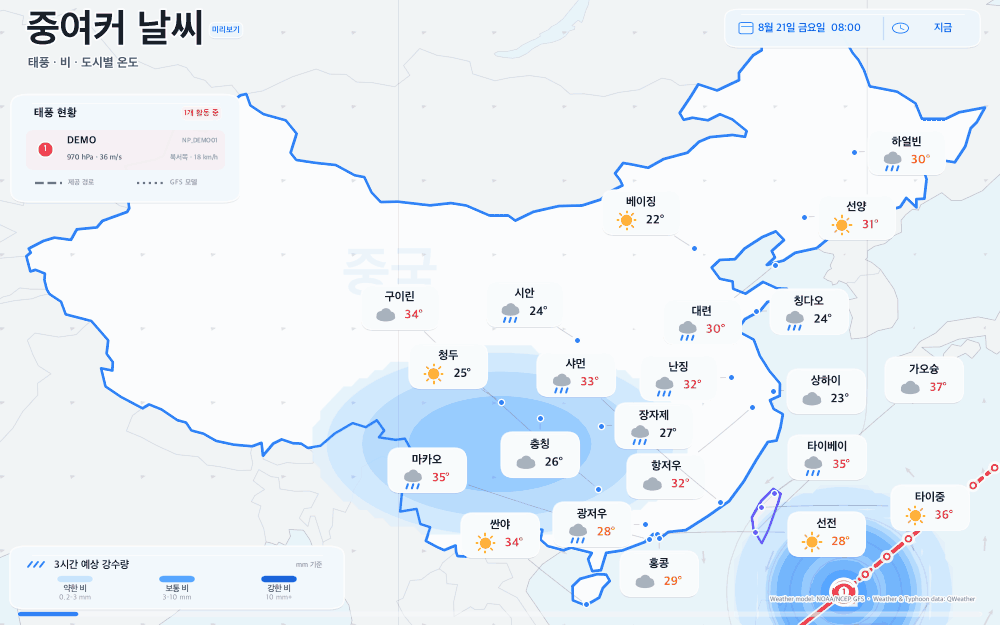
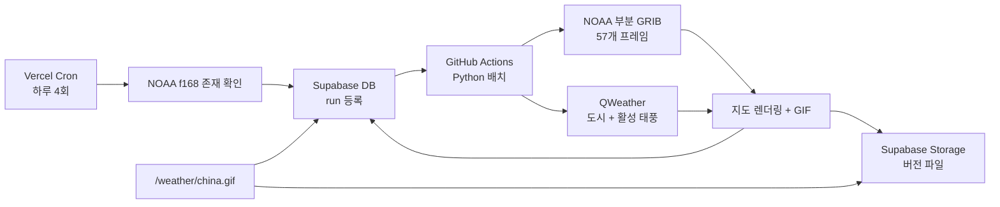

# 중국·대만 7일 날씨 GIF 서비스

NOAA/NCEP GFS의 중국 중심 격자 자료와 QWeather의 중국·대만 도시 및 태풍 정보를 합쳐 3시간 간격, 최대 168시간의 animated GIF를 자동 생성하는 독립 프로젝트입니다. 화면은 전문 일기도보다 `태풍 → 비 → 도시별 온도`를 먼저 읽을 수 있는 밝고 단순한 소비자형 UI로 설계했습니다. 기존 웹서비스를 수정하지 않고 별도 배포하거나, 필요한 파일 묶음만 나중에 옮겨 붙일 수 있습니다.



> 예시 GIF에는 실제 예보가 아닌 합성 데이터가 들어가며 화면에 `미리보기`라고 표시됩니다. 도시 온도·날씨 아이콘과 태풍 이동 UI를 확인하기 위한 디자인 검증본입니다.

태풍이 두 개일 때의 번호·색상 대응과 고정 패널은 [2개 태풍 화면 예시](public/sample/china-weather-two-typhoon.gif)에서 확인할 수 있습니다.

전체 데이터 경로 검증용으로 만든 [실제 NOAA GFS 57프레임 GIF](public/sample/china-weather-noaa-2026082018.gif)와 [검증 manifest](public/sample/china-weather-noaa-2026082018.json)도 포함되어 있습니다. 이 검증본은 QWeather 비밀키 없이 생성했기 때문에 도시 온도가 `--°`로 표시되며, 운영 배치에서는 QWeather 온도·아이콘과 활성 태풍이 자동으로 추가됩니다.

## 구현 범위

- NOAA NOMADS Grib Filter에서 중국이 화면을 채우는 `72E–136E, 17N–55N` 영역만 요청
- 변수는 `APCP`, `PRMSL`, `UGRD 10m`, `VGRD 10m`만 요청
- 0–168시간을 3시간 간격으로 렌더링하여 총 57프레임 생성
- 별도의 제목·하단 영역 없이 제목, 날짜, 출처, 범례, 진행 막대를 모두 지도 안에 배치
- 중국 국경은 토스 블루 계열, 대만 윤곽은 보라 계열로 강조하고 주변 지역은 옅게 처리
- 비는 파란색 단일 계열의 강도 면으로, 해면기압과 10m 바람은 옅은 배경 참고 정보로 표시
- 중국·대만 22개 여행 도시를 모두 동일한 크기의 `도시명 + 날씨 아이콘 + 온도` 카드로 표시
- 도시 카드는 7일 전체에서 같은 위치에 고정하고 태풍 정보는 서쪽 빈 공간의 공통 패널에 고정
- 22개 도시 카드 모두 하나의 동일한 크기·모서리·전체 날씨 아이콘 구조를 사용
- 도시명은 카드 상단 중앙에 큰 진한 글씨로 강조하고 아이콘·온도 행도 고정 중앙 슬롯에 정렬
- 상단 제목은 큰 `중여커 날씨`로 표시
- 상단 날짜 캡슐은 크고 고정된 박스 안에서 `날짜·시간 | 예보 시점` 두 칸으로 분리
- 날짜 캡슐에는 플랫폼과 관계없이 동일하게 보이는 벡터 캘린더·시계 아이콘 사용
- 하단 강수 범례는 `3시간 예상 강수량`과 약한 비·보통 비·강한 비의 컬러밴드 및 mm 범위를 표시
- 날짜·도시·범례·경로 안내는 동일한 반투명 표면, 흰 광학 하이라이트, 쿨톤 헤어라인, 한 단계의 부드러운 그림자로 통일
- 유리 효과는 정보 위계를 위한 고정 UI에만 절제해 사용하고 지도·강수·국경선은 선명한 콘텐츠 레이어로 유지
- 활성 태풍은 서쪽의 하나의 글래스 패널에 1–3행으로 자동 정리하고 이름·번호·기압·풍속·이동을 표시
- 지도상의 태풍 눈과 패널 행에 같은 `1·2·3` 번호와 태풍별 고유 색을 반복해 긴 위치 연결선 없이도 대응 관계를 식별
- 레이어 순서는 지도 → 비·기압·바람 → 태풍 경로 → 도시 카드 → 번호가 있는 태풍 눈 → 고정 패널·범례 → 제목·날짜
- 도시 카드·도시 위치점·서쪽 태풍 패널·화면 가장자리의 충돌을 계산해 겹침과 잘림 방지
- 중국: 베이징·상하이·칭다오·시안·청두·충칭·장자제·광저우·선전·홍콩·하얼빈·대련(주요 도시 카드)·선양·항저우·난징·샤먼·싼야·구이린·마카오
- 대만: 타이베이·타이중·가오슝
- QWeather 활성 태풍만 현재 정보·과거 경로·제공 예보 경로 표시
- 태풍 소용돌이 아이콘이 시간에 따라 예상 경로 위를 이동
- 상단 제목은 지도 위에 직접 표시하고 날짜·시간은 고정된 옅은 블루 글래스 캡슐로 정리
- 하단에는 3시간 강수 범례와 재생 진행선만 두어 지도 집중도 유지
- 태풍마다 번호와 색을 일치시키고, QWeather 제공 경로(파선)와 GFS 해면기압에서 추적한 모델 중심(점선)은 선 모양으로 구분
- GIF와 manifest를 Supabase Storage의 GFS run별 새 경로에 업로드
- `weather_assets`에 최신 자산 메타데이터와 생성 상태 기록
- Next.js의 고정 URL `/weather/china.gif`에서 최신 버전을 프록시
- ETag, Last-Modified, 조건부 GET/HEAD 및 계층별 Cache-Control 적용
- 같은 GFS run은 DB의 원자적 claim으로 중복 생성을 건너뜀
- Vercel Cron은 최신 run 확인/작업 등록/트리거만 수행하고, 무거운 작업은 GitHub Actions에서 실행

## 구조



Vercel 함수 안에서 전체 렌더링을 하지 않습니다. 57개 GRIB 다운로드, ecCodes 해석, 지도 57장 렌더링은 함수 실행시간과 배포 번들에 부담이 크기 때문입니다. Vercel 경로는 30초 이내의 상태 확인과 GitHub dispatch만 담당합니다.

## 1. 로컬 설치와 샘플 확인

Python 3.11 이상, Node.js 20.9 이상이 필요합니다.

```bash
python3 -m venv .venv
source .venv/bin/activate
python -m pip install --upgrade pip
python -m pip install -e ".[test]"

npm install
cp .env.example .env.local
```

합성 샘플 GIF 생성:

```bash
python -m weather_pipeline demo
```

테스트 및 Next.js 빌드:

```bash
pytest
npm run typecheck
npm run lint
npm run build
```

실제 NOAA 최신 완료 run 확인:

```bash
python -m weather_pipeline probe
```

Supabase 업로드 없이 실제 자료로 로컬 렌더링:

```bash
python -m weather_pipeline generate --gfs-run auto --no-upload
```

최대 168시간이 모두 올라온 run만 선택하므로, 막 시작된 최신 run보다 한 cycle 전 run이 선택되는 것은 정상입니다.

## 2. QWeather 설정

QWeather Console의 **Settings > API Host**에서 전용 `*.qweatherapi.com` 호스트를 확인하고, API Key와 함께 설정합니다.

```dotenv
QWEATHER_API_HOST=https://abc123.qweatherapi.com
QWEATHER_API_KEY=...
QWEATHER_LANGUAGE=ko
```

인증값은 브라우저에 노출하지 않으므로 `NEXT_PUBLIC_` 접두사를 붙이지 않습니다. 현재 좌표 기반 API(`/weather/v1/current`, `/weather/v1/hourly`)를 먼저 사용하며 계정이 기존 v7만 지원하면 `/v7/weather/now`, `/v7/weather/168h`로 자동 재시도합니다. 강제로 선택하려면 `QWEATHER_API_MODE=modern` 또는 `legacy`를 추가할 수 있습니다.

정상적으로 modern API를 쓰면 한 번의 생성마다 도시 22곳 × (현재 1회 + 168시간 예보 1회), 즉 도시 데이터 약 44회를 호출합니다. 여기에 태풍 목록 1회와 활성 태풍별 track/forecast 2회가 추가됩니다.

태풍은 다음 API를 사용합니다.

- `/v7/tropical/storm-list?basin=NP&year=YYYY`
- `/v7/tropical/storm-track?stormid=...`
- `/v7/tropical/storm-forecast?stormid=...`

활성 태풍이 없으면 서쪽 태풍 패널과 경로 안내가 함께 숨겨집니다. 한 개면 1행, 두 개면 2행으로 패널 높이가 자동 조절되며 최대 세 개까지 같은 규칙으로 표시합니다. 태풍 API 사용 가능 여부와 요금은 QWeather 계정 플랜에서 확인해야 합니다. 태풍 API가 실패해도 GFS와 도시 오버레이 생성은 계속됩니다.

## 3. Supabase 생성

Supabase Dashboard의 SQL Editor에서 다음 파일 전체를 실행합니다.

```text
supabase/migrations/001_weather_assets.sql
```

이 SQL은 다음을 만듭니다.

- private bucket `weather-assets` (GIF 최대 50MB)
- `public.weather_assets` 테이블
- 최신 ready 자산용 부분 인덱스
- 중복/동시 실행을 막는 `claim_weather_generation()` RPC
- service role만 접근 가능한 권한 설정

다른 bucket 이름을 쓰려면 마이그레이션의 bucket id와 `WEATHER_STORAGE_BUCKET`을 함께 바꿉니다.

필수 환경변수:

```dotenv
SUPABASE_URL=https://YOUR_PROJECT.supabase.co
SUPABASE_SERVICE_ROLE_KEY=...
WEATHER_STORAGE_BUCKET=weather-assets
WEATHER_ASSET_KEY=china-7d
```

Service Role Key는 Vercel과 GitHub Actions의 서버 비밀값에만 넣습니다. 저장 경로는 예를 들어 아래처럼 run별로 달라집니다.

```text
china-7d/2026082100/china-weather-2026082100-1a2b3c4d5e6f.gif
china-7d/2026082100/manifest-20260821T051234Z.json
```

GFS run과 내용 해시가 경로에 들어가며 같은 경로를 덮어쓰지 않기 때문에 Supabase CDN의 오래된 객체 문제를 피할 수 있습니다. 중간 실패 후 같은 run을 재시도해 QWeather 내용이 바뀌어도 새 불변 경로가 만들어집니다.

## 4. GitHub Actions 배치

프로젝트를 GitHub 저장소에 넣고 `Settings > Secrets and variables > Actions`에 아래 Repository secrets를 추가합니다.

```text
SUPABASE_URL
SUPABASE_SERVICE_ROLE_KEY
QWEATHER_API_HOST
QWEATHER_API_KEY
```

`.github/workflows/weather-gif.yml`은 UTC `05:35, 11:35, 17:35, 23:35`에 실행됩니다. 수동 실행과 Vercel의 `repository_dispatch`도 지원합니다. DB claim이 같으므로 스케줄과 Vercel trigger가 겹쳐도 같은 run은 한 번만 렌더링됩니다.

처음에는 GitHub Actions의 **Generate China weather GIF > Run workflow**에서 `auto`로 수동 실행하여 다음을 확인합니다.

1. 작업이 성공했는지
2. Storage에 GIF와 manifest가 생겼는지
3. `weather_assets`의 해당 row가 `ready`인지
4. `frame_count=57`, `sha256`, `generated_at`이 기록됐는지

## 5. Vercel 배포와 Cron

이 디렉터리를 별도 Vercel 프로젝트로 import하고 다음 환경변수를 Production에 추가합니다.

```text
SUPABASE_URL
SUPABASE_SERVICE_ROLE_KEY
CRON_SECRET
GITHUB_ACTIONS_REPOSITORY=owner/repository
GITHUB_ACTIONS_TOKEN
WEATHER_STORAGE_BUCKET=weather-assets
WEATHER_ASSET_KEY=china-7d
```

`CRON_SECRET`은 16자 이상의 무작위 값으로 만듭니다. `GITHUB_ACTIONS_TOKEN`은 대상 저장소에 제한한 fine-grained token을 사용하고 Repository contents write 권한을 부여합니다. Vercel에는 Python 렌더링 의존성이 필요하지 않습니다.

기본 `vercel.json`은 Hobby 요금제에서도 배포되도록 UTC `05:15`에 하루 한 번 `/api/cron/weather`를 호출합니다. 실제 하루 4회 생성은 앞 절의 GitHub Actions 스케줄이 담당합니다. Vercel Pro 이상에서 Vercel 확인도 하루 4회 사용하려면 schedule만 아래처럼 바꿉니다.

```json
"schedule": "15 5,11,17,23 * * *"
```

Cron 라우트는 다음 순서로 동작합니다.

1. `CRON_SECRET` Bearer 인증 확인
2. NOAA의 f168 인덱스가 존재하는 최신 run 탐색
3. 같은 `asset_key + gfs_run`이 있으면 즉시 skip
4. DB에 queued row 삽입
5. GitHub `weather-gfs-ready` repository dispatch 호출

GitHub token을 Vercel에 넣고 싶지 않다면 두 GitHub 환경변수를 생략해도 됩니다. 그 경우 Vercel은 queued 상태까지만 만들고, 20분 뒤 GitHub 자체 스케줄이 그 run을 claim합니다.

로컬에서 Cron 라우트를 시험할 때:

```bash
curl -H "Authorization: Bearer $CRON_SECRET" \
  http://localhost:3000/api/cron/weather
```

## 6. 고정 GIF URL과 네이버 카페

배포 도메인이 `https://weather.example.com`이라면 고정 주소는 다음과 같습니다.

```text
https://weather.example.com/weather/china.gif
```

HTML을 사용할 수 있는 곳에서는:

```html

```

이 URL은 매번 DB에서 최신 버전 경로를 찾은 뒤 private Storage 파일을 프록시합니다. 응답에는 다음이 포함됩니다.

- `ETag`: GIF SHA-256
- `Last-Modified`: 생성 시각
- `Cache-Control`: 브라우저 5분, CDN 15분, stale-while-revalidate 1분
- 조건부 `GET`/`HEAD`의 `304 Not Modified`
- `X-Weather-GFS-Run`

네이버가 자체 이미지 프록시에 이미지를 장시간 보관하는 경우 HTTP 헤더만으로 즉시 갱신을 강제할 수는 없습니다. 그런 경우 같은 endpoint에 현재 run 쿼리를 붙인 주소를 한 번 다시 등록하면 URL 자체가 달라져 캐시를 우회할 수 있습니다.

```text
https://weather.example.com/weather/china.gif?v=2026082100
```

정상 운영 주소는 쿼리 없는 고정 URL을 유지하고, 네이버 캐시가 실제로 멈춘 경우에만 `?v=GFS_RUN`을 사용하세요.

## 7. 표시와 데이터 해석

- 비: 각 3시간 구간 누적량(mm). GFS가 run 시작부터 누적값을 주는 경우 앞 프레임과 차분하며, 약·보통·강의 파란색 농도로 단순화합니다.
- 온도·아이콘: 각 프레임 시각과 가장 가까운 QWeather 도시별 시간 예보입니다.
- 태풍 제공 경로: QWeather가 제공한 태풍 예보이며 태풍별 고유 색의 파선과 번호가 있는 움직이는 태풍 눈으로 표시합니다.
- GFS 모델 중심: 현재 태풍 중심 근처의 해면기압 최소를 시간 순서로 추적한 보조 지표이며 같은 태풍 색의 점선으로 표시합니다.
- 등압선·바람: 해면기압 8hPa 간격과 GFS 10m U/V 화살표를 매우 옅게 표시하는 참고 정보입니다.

GFS 모델 중심선은 공식 태풍 경보나 기관 예보가 아닙니다. 화면에서도 `GFS 모델`로만 표시합니다.

모든 프레임 하단에는 다음 attribution이 들어갑니다.

```text
Weather model: NOAA/NCEP GFS · Weather & Typhoon data: QWeather
```

## 8. 환경변수 전체 목록

| 이름 | 사용처 | 필수 | 기본값 |
|---|---|---:|---|
| `SUPABASE_URL` | Next + batch | 업로드/공개 URL에 필수 | 없음 |
| `SUPABASE_SERVICE_ROLE_KEY` | Next + batch | 업로드/공개 URL에 필수 | 없음 |
| `QWEATHER_API_HOST` | batch | QWeather overlay에 필수 | 없음 |
| `QWEATHER_API_KEY` | batch | QWeather overlay에 필수 | 없음 |
| `QWEATHER_LANGUAGE` | batch | 아니오 | `ko` |
| `QWEATHER_API_MODE` | batch | 아니오 | `auto` |
| `CRON_SECRET` | Vercel | Cron 사용 시 필수 | 없음 |
| `GITHUB_ACTIONS_REPOSITORY` | Vercel | dispatch 사용 시 필수 | 없음 |
| `GITHUB_ACTIONS_TOKEN` | Vercel | dispatch 사용 시 필수 | 없음 |
| `WEATHER_STORAGE_BUCKET` | Next + batch | 아니오 | `weather-assets` |
| `WEATHER_ASSET_KEY` | Next + batch | 아니오 | `china-7d` |
| `NOAA_GFS_BASE_URL` | Next + batch | 아니오 | `https://nomads.ncep.noaa.gov` |
| `WEATHER_WORK_DIR` | batch | 아니오 | `work` |
| `WEATHER_OUTPUT_DIR` | batch | 아니오 | `artifacts` |
| `WEATHER_MAX_FORECAST_HOUR` | batch | 아니오 | `168` |
| `WEATHER_FRAME_STEP_HOURS` | batch | 아니오 | `3` |
| `WEATHER_DOWNLOAD_WORKERS` | batch | 아니오 | `3` |
| `WEATHER_FRAME_DURATION_MS` | batch | 아니오 | `420` |
| `WEATHER_GIF_COLORS` | batch | 아니오 | `192` |

## 9. 운영 점검

상태 JSON:

```text
GET /api/weather/latest
```

자주 보는 실패 원인:

- `weather_asset_not_ready`: 첫 GitHub Action을 아직 실행하지 않음
- QWeather 401/403: 전용 API Host, Key, 해당 API 권한 확인
- NOAA non-GRIB response: 아직 파일 발행 중이거나 NOMADS 일시 장애; 다음 스케줄에서 재시도
- GIF 50MB 초과: `WEATHER_GIF_COLORS`, 이미지 크기 또는 프레임 수를 낮추거나 migration의 제한을 조정
- `claim=false`: 동일 run이 ready 또는 처리 중이므로 정상적인 중복 방지

## 공식 문서

- [NOAA/NCEP NOMADS GFS 0.25° Grib Filter](https://nomads.ncep.noaa.gov/gribfilter.php?ds=gfs_0p25)
- [QWeather API Host](https://dev.qweather.com/en/docs/configuration/api-host/)
- [QWeather API request/authentication](https://dev.qweather.com/en/docs/configuration/api-config/)
- [QWeather hourly forecast](https://dev.qweather.com/en/docs/api/weather/weather-hourly-forecast/)
- [QWeather tropical cyclone](https://dev.qweather.com/en/docs/api/tropical-cyclone/)
- [Supabase Storage uploads](https://supabase.com/docs/guides/storage/uploads/standard-uploads)
- [Vercel Cron Jobs](https://vercel.com/docs/cron-jobs)
